# GDD Champinchanted
Champinchanted es un videojuego de dos jugadores, basado en el clásico juego de "Atrapa la bandera", pero renovado y con un estilo visual 2D, en el que dos setas deberán correr por un mundo de plataformas encantado para capturar la bandera y llevársela a su base.

## Equipo de desarrollo
Ángela Sánchez Díaz 
* a.sanchezdi.2022@alumnos.urjc.es   
* Github: angelasdiaz    

Garazi Blanco Jauregi   
* g.blancoj.2022@alumnos.urjc.es  
* Github: Gara03   

Alberto López García de Ceca   
* a.lopezgar.2022@alumnos.urjc.es   
* Github: ratamolinera777     

# Video
https://youtu.be/AyVuBLUymPQ

# Índice
[1. Introducción](#introduccion-definicion-del-juego)   
[2. Historia y narrativa](#historia-y-narrativa)   
[3. Mecánicas del juego](#mecanicas-del-juego)   
[4. Música](#musica)   
[5. Arte y estilo visual](#arte-y-estilo-visual)   
[6. Arquitectura y guía de ejecución](#arquitectura-y-guia-de-ejecucion)  

# 1. Introducción: Definición del juego
## 1.1. Concepto del juego
Champinchanted, es un videojuego diseñado para dos jugadores, ambientado en un emocionante entorno de plataformas, místico y mágico.   

El objetivo del juego es capturar una bandera que aparece de forma aleatoria en diferentes puntos del mapa. Cada jugador comienza en su "casa", una base fija situada en lados opuestos del mapa. Desde allí, ambos deberán correr y saltar para llegar hasta la bandera antes que su oponente. Cuando un jugador capture la bandera, deberá regresar rápidamente a su casa para marcar un punto. El juego se compone de tres rondas y el jugador que gane más rondas será declarado vencedor.  

El desafío no solo radica en capturar la bandera, sino también en sobrevivir a los obstáculos y hechizos que aparecerán aleatoriamente en el mapa. Estos hechizos y trampas están diseñados para entorpecer y complicar la tarea de los jugadores, pudiendo ser utilizados por estos de manera estratégica para ralentizar o incluso detener al oponente.   

El juego ofrece un equilibrio perfecto entre la acción rápida de las plataformas y la estrategia de saber cuándo atacar, defender o utilizar los hechizos a tu favor.  
  
## 1.2. Características principales 
Los jugadores pueden elegir entre varios personajes, cada uno con sus propios diseños. Esto aporta un toque de personalización y hace que el juego sea más atractivo visualmente.  

El mapa está lleno de plataformas, lo que añade un reto adicional de movimiento y salto. Los jugadores deben maniobrar hábilmente a través de los niveles para alcanzar la bandera y evitar a su oponente.  

Durante la partida, aparecen hechizos (ítems), en lugares aleatorios del mapa, que los jugadores pueden recoger y activar. Estos hechizos complican el reto, al interferir con el progreso del oponente, haciendo que aumente la dificultad de obtener la bandera.  

La posición de la bandera cambia de manera aleatoria en cada ronda, lo que obliga a los jugadores a adaptarse constantemente y evita que las estrategias se vuelvan repetitivas.  

Además, se ofrecen cuatro mapas distintos, uno por cada estación del año, evitando así, nuevamente, que el juego sea demasiado repetitivo y el jugador pierda el interés.  

Los controles son fáciles de aprender pero difíciles de dominar. Esto permite que tanto jugadores novatos como expertos disfruten del juego, pero también recompensa la habilidad.  

El videojuego tiene la posibilidad de jugar tanto en local como en red.  

## 1.3. Género
Es un juego de plataformas competitivas, que sigue la dinámica del “Captura la bandera”.   

La acción se basa en las mecánicas clásicas de escenarios de plataformas donde los jugadores deben moverse, saltar y utilizar habilidades en un entorno dinámico y lleno de obstáculos.  

La mecánica central de capturar la bandera y llevarla a una base añade un elemento de estrategia y competición, lo que lo encuadra también dentro de los juegos competitivos locales o en línea.  

Además, los hechizos y obstáculos que afectan a los jugadores aportan también acción y estrategia.  

## 1.4. Propósito y público objetivo
El propósito del juego es ofrecer una experiencia competitiva y divertida para dos jugadores, combinando mecánicas de plataformas rápidas y acción estratégica con el clásico objetivo de captura de bandera. Los jugadores deben usar sus habilidades de movimiento, su conocimiento del mapa y los recursos que encuentren para superar a su oponente, atrapando la bandera y llevándola a su base. Además de ser un reto físico, el juego busca fomentar la estrategia y el uso inteligente del entorno, mientras mantiene un ritmo de juego dinámico y emocionante.  

Por otro lado el público objetivo son:  
 - **Jugadores casuales** que disfrutan de partidas rápidas y dinámicas. Al ser un juego de plataformas y multijugador, atraerá a aquellos que buscan una experiencia divertida que puedan jugar con amigos en sesiones cortas.
 - **Jugadores competitivos** que valoran juegos con una mezcla de habilidades y estrategia. El formato de capturar la bandera, combinado con la posibilidad de interferir en los planes del oponente mediante hechizos, atraerá a aquellos que disfrutan de enfrentamientos directos y de mejorar sus tácticas.
 - **Jugadores que buscan juegos multijugador**. Los que disfrutan jugando en compañía de amigos encontrarán este juego particularmente atractivo.
 - **Jugadores de plataformas** que valoran la destreza y el dominio de los controles, saltos precisos y movimientos fluidos. Disfrutarán del reto de capturar la bandera mientras sortean obstáculos.
   
Todo esto referido a públicos de todas las edades, aunque está más enfocado a personas de 7 años en adelante, y con clasificación PEGI 7, por competitividad sin violencia y la estética amigable.

## 1.5. Interacción
Champinchanted es un videojuego de 2 jugadores con representación 2D, que ofrece una interacción dinámica con controles intuitivos, que se especifican más adelante, pero que requieren de práctica para poder dominarlos. 

La competición entre los jugadores genera una interacción directa en la que pueden interceptar, bloquear, huir y perseguir a su oponente, usando hechizos que aparecen aleatoriamente en el mapa. 

Además, el juego ofrece una retroalimentación visual y sonora a los jugadores al capturar la bandera o lanzar hechizos.

Existen dos opciones de juego: local o en línea, lo que aumenta y añade flexibilidad a la interacción con el juego. 

## 1.6. Modelo de negocio
Champinchanted es un videojuego de acceso gratuito (freeware) que permite a los jugadores jugar desde cualquier navegador sin coste alguno. 

## 1.7. Alcance
El juego está diseñado para partidas de 2 jugadores, en modo local o en línea. El formato "uno contra uno" asegura una experiencia competitiva directa y rápida.

Cada partida está dividida en hasta 3 rondas. Estas son cortas, de aproximadamente 5 minutos cada una, lo que significa que una partida completa tiene una duración máxima de 15 minutos. Esto hace que sea ideal para sesiones rápidas de juego.

Inicialmente ofrecerá un único modo de juego, basado en enfrentamientos directos para capturar la bandera y ganar más rondas que el oponente. Sin embargo, los jugadores podrán ajustar reglas básicas como la cantidad de rondas o la aparición de hechizos.

La versión inicial contará con 5 personajes para elegir, cada uno con un diseño único y 4 mapas distintos, con diseños y plataformas completamente diferentes.

El juego estará disponible para PC, y se podrá jugar tanto de manera local como en línea.

Si bien es este el alcance inicial, el juego tiene potencial para expandirse con más modos de juego, como un modo cooperativo o competitivo con más de 2 jugadores, y la posibilidad de incluir más hechizos y mapas a través de actualizaciones. Además de un sistema de invitaciones rápidas para facilitar la jugabilidad.

También en el futuro, se podrá cambiar el modelo de negocio del videojuego para poder obtener rentabilidad, por ejemplo mediante compras dentro del juego o venta de expansiones.

## 1.8. Plataforma
El videojuego está diseñado para ser jugado en navegadores web de ordenadores, utilizando el framework Phaser, un potente motor de desarrollo de videojuegos 2D basado en JavaScript y HTML5. 

## 1.9. Categoría
### 1.9.1. Debilidades
Aunque el juego está orientado a la competición 1 contra 1, la falta de modos de juego alternativos o para más jugadores, puede limitar el atractivo para aquellos usuarios que busquen un rango de jugabilidad mayor. 

Además, el videojuego puede resultar algo repetitivo, a pesar de contar con varios mapas y personajes. La falta de diferenciación de estos en cuanto a habilidades, puede resultar menos interesante y contar con únicamente 4 mapas, en vez de tener varios niveles, puede también reducir el interés del jugador. 

Y por último, la limitación del videojuego a ordenadores con acceso a un navegador, puede ser una gran debilidad para jugadores que prefieran usar otras plataformas como consolas. 

### 1.9.2. Amenazas
Existen muchos juegos de plataformas multijugador competitivos, como Brawlhalla o Smash Bros. Esto puede hacer que nuestro videojuego no destaque, ante la existencia de otros con un éxito ya consolidado. Además, si el juego no se actualiza con frecuencia, los jugadores pueden cansarse y pasarse a juegos más novedosos y actualizados.

### 1.9.3. Fortalezas
La jugabilidad rápida y dinámica atrae a jugadores que buscan una experiencia de juego corta y divertida, sin compromiso de tiempo. 

El diseño y la estética del videojuego también es una gran fortaleza, ya que está muy cuidado y puede atraer a jugadores que valoren estos aspectos, o que se guíen por lo que ven a primera vista para elegir entre un videojuego u otro. 

Además, la rejugabilidad que genera la aleatoriedad de elementos como las banderas o los hechizos, provoca que cada partida sea diferente y fresca. 

### 1.9.4. Oportunidades
El juego tiene un gran potencial para expandirse en un futuro, con todos los aspectos ya mencionados en el apartado de alcance, que pueden atraer a nuevos jugadores, eliminando o cambiando aquellos aspectos que actualmente hacen que el videojuego sea un poco repetitivo. 

Y otros aspectos como un buen marketing o la integración en torneos online pueden hacer que despegue entre los amantes de los videojuegos indie.

## 1.10. Licencia
La licencia del videojuego es Apache 2.0, una licencia de código abierto que implica que los usuarios tienen libertad de usar, copiar y modificar el código del videojuego; redistribuir el software y su uso con fines comerciales, siempre y cuando den crédito a los autores. 

# 2. Historia y narrativa
## 2.1. Ambientación
El mundo del videojuego es un bosque encantado, vibrante y encantador, lleno de naturaleza, fauna y elementos mágicos. Desde grandes troncos y champiñones, hasta hechizos y criaturas del bosque. Todo esto ambientado en las cuatro estaciones del año (primavera, verano, otoño e invierno). 

## 2.2. Objetivos del jugador  
El objetivo del jugador y de su oponente, es llegar desde su base hasta el lugar aleatorio en el que se encuentre la bandera, ayudándose de las diversas plataformas distribuidas por el mapa, alcanzando la bandera y llevándola de vuelta a su base, sin que el otro jugador le alcance y le quite la bandera. 

De esta forma, el jugador que consiga el objetivo, habrá ganado la ronda. El jugador que más rondas haya ganado de entre las tres que componen una partida, será proclamado ganador.

# 3. Mecánicas del juego
## 3.1. Gameplay
La jugabilidad de este juego de plataformas multijugador está diseñada para ser rápida, estratégica y dinámica, combinando elementos de competencia directa y la interacción con el entorno del mapa. 

Cada jugador tiene como objetivo principal capturar la bandera, que aparece de manera aleatoria en el mapa, y llevarla de vuelta a su base . Gana la ronda el jugador que logre capturar y asegurar la bandera en su base primero. Se divide en 3 rondas y el jugador que gane más rondas es el vencedor de la partida.

Antes de cada partida, los jugadores pueden elegir entre una variedad de personajes. No existen diferencias en las habilidades de estos.

Cada jugador cuenta con 25 puntos de vida al comienzo de cada ronda, la vida puede bajar o subir en función de los ataques y/o hechizos que utilice y/o reciba, siendo siempre el máximo de vida 25. La vida de ambos jugadores se mostrará en pantalla en todo momento.

El mapa está lleno de plataformas de diferentes alturas y obstáculos, lo que requiere que los jugadores utilicen saltos y maniobras precisas para moverse por el entorno.

A lo largo de cada ronda, aparecerán hechizos aleatoriamente en el mapa, que los jugadores pueden recoger. Estos hechizos pueden ser usados tanto para dificultar el avance del oponente como para otorgar ventajas estratégicas. Por ejemplo, hechizos de trampa, velocidad o aturdimiento.

A diferencia de los juegos por turnos, ambos jugadores se mueven y actúan en tiempo real, lo que añade un nivel de tensión constante. No hay pausas o tiempos muertos, los jugadores deben tomar decisiones rápidas y reaccionar a los movimientos de su oponente mientras se desplazan por el mapa.

La bandera cambia de posición de manera aleatoria después de cada ronda. Una vez que un jugador la recoge, el otro jugador tiene la opción de interceptar o bloquear su camino para evitar que la bandera llegue a la base. Si el jugador que tiene la bandera es derrotado o interrumpido, la bandera regresa a su posición inicial y la carrera para capturarla comienza de nuevo.

Cada partida consta de hasta 3 rondas, y cada ronda se gana cuando un jugador lleva la bandera a su base. El primer jugador en ganar las 3 rondas es el ganador del juego. Las rondas están diseñadas para ser rápidas, lo que mantiene la intensidad del juego.

Los jugadores pueden correr, saltar y usar hechizos contra sus oponentes. 

Los jugadores no solo deben centrarse en capturar la bandera, sino también en evitar que su oponente lo haga. Pueden recoger hechizos estratégicamente, o utilizar las plataformas de manera efectiva para obtener ventaja en la batalla por la bandera. Hay muchas oportunidades de interacción directa que crean un ambiente competitivo.

## 3.2. Controles
### 3.2.1. Modo local
En el modo local, los dos jugadores utilizan el mismo ordenador para manejar a sus personajes, por lo que los controles son los siguientes: 

* El primer jugador emplea las teclas ‘A’ y ‘D’ para desplazarse a la izquierda y a la derecha, respectivamente. La tecla ‘W’ para saltar y la tecla ‘E’ para lanzar un hechizo.
* El segundo jugador utiliza las flechas izquierda (←) y derecha (→) para desplazarse, respectivamente a la izquierda y a la derecha, la flecha arriba (↑) para saltar, y la barra espaciadora para lanzar un hechizo.

### 3.2.2. Modo en línea
En el modo en línea, cada jugador utiliza su propio ordenador, por lo que los controles son los mismos para ambos.

El jugador podrá utilizar las teclas ‘A’ o (←) para desplazarse a la izquierda, las teclas ‘D’ o (→) para desplazarse a la derecha; las teclas ‘W’ o (↑) para saltar; y la barra espaciadora o la tecla ‘E’ para lanzar un hechizo.

## 3.3. Acciones del jugador
El jugador puede moverse horizontalmente por el mapa y saltar para superar obstáculos y ascender sobre las plataformas.

Además, puede realizar las acciones de capturar la bandera, que recoge automáticamente al pasar por encima de esta, y llevarla a la base, acción que se dará por completada de forma automática cuando el jugador esté sobre su casa.

También puede recoger hechizos, pasando sobre ellos, y lanzar hechizos al oponente, utilizando las teclas correspondientes. A su vez debe huir del oponente para evitar que este le quite la bandera, o perseguirle, en el caso de que sea este otro el que esté en posesión de esta.

Y por último puede realizar otras acciones, ajenas al tiempo de partida, como seleccionar un personaje o un mapa de juego. 

## 3.4. Diagrama de estados
El diagrama de estados entre las distintas pantallas del videojuego es el siguiente.

# 4. Música
## 4.1. Estilo de música
El videojuego cuenta con música de ambiente en todas sus pantallas. Cuando el jugador no se encuentre en la pantalla de partida, es decir, en la pantalla de inicio, menús, etc., la música será relajada, con una combinación de elementos místicos y misteriosos, instrumentos de viento y cuerda suaves y sonidos de campanillas para enfatizar el aspecto mágico del juego. 

Cuando el jugador comience la partida, la música cogerá un tono mucho más acelerado y tenso para reflejar la competitividad del juego. Esta música tiene más elementos de percusión y será más grave, pero sin perder ese elemento místico característico del videojuego.

Por último, cuando la partida termine, la pantalla de victoria o derrota tendrá también un sonido diferente, siendo más triunfante cuando el jugador haya ganado y menos intenso cuando haya perdido. En caso de jugar en local, sonará el tema de victoria para el jugador vencedor.

## 4.2. Efectos de sonido
Cuando el jugador captura la bandera, suena un pequeño tintineo que indica a ambos jugadores que la bandera ha sido capturada. 

Y al lanzar hechizos, también suena una especie de puff o esfumación sobre el jugador que ha recibido el efecto del hechizo.

# 5. Arte y estilo visual
## 5.1. Estilo gráfico
El estilo del videojuego es 2D, ambientado en un bosque encantado de champiñones y setas. Es un juego colorido, pero con una estética orgánica y un poco misteriosa. 

La paleta de colores está compuesta por verdes oscuros, marrones y tonos amarillos suaves para el entorno del bosque y el suelo, aunque varían según la estación. Los champiñones tienen colores vibrantes: rojos intensos, anaranjados brillantes y púrpuras, con detalles de manchas blancas.

Los mapas se encuentran ensombrecidos por los elementos del bosque, e iluminados por luciérnagas y champiñones bioluminiscentes que iluminan áreas más oscuras. 

## 5.2. Referencias visuales
Tiene un toque inspirado en la naturaleza fantástica, similar a juegos como *Ori and the Blind Forest* o *Trine*.

## 5.3. Diseño de personajes
Los personajes principales tienen un diseño único, inspirado en diferentes tipos de setas. Las paletas de colores que siguen son únicas y temáticas para cada personaje, pero manteniendo una coherencia común.  

**Perretxiko**
El diseño de Perretxiko está basado en la seta Amanita Muscaria. Una seta tóxica que envenena a los insectos con los que entra en contacto, es por esto que hemos decidido representar a este personaje enfadado. Perretxiko está inspirado en la cultura vasca, con su característica “txapela” y los colores de la bandera vasca o “ikurriña”. 

**Champichip**
Champichip es una combinación del champiñón portobello y la patata, hemos querido representar una personalidad divertida y despreocupada para este personaje.

**Mariñón**
Para este personaje nos hemos inspirado en la Hygrocybe conica, también conocida como Seta sombrero de bruja. Los colores empleados representan la bandera lgbtiq+ como forma de apoyo y solidaridad hacia ese colectivo.

**Champistar**
El personaje de Champistar está inspirado por la cultura emo y alternativa, le hemos querido representar con la seta Cortinarius violaceus, una seta morada oscura que recuerda mucho a esta estética.

**Biblioseta**
La Biblioseta está basada en el Hygrocybe coccinea, un pequeño y poco común hongo. Este personaje tiene la característica distintiva de ser más pequeño que el resto.

## 5.4. Diseño de entornos
### 5.4.1. Fondos
Hay 4 tipos diferentes de mapas, cada uno inspirado en una estación. Todos los mapas representan paisajes de bosques densos y húmedos, con árboles gigantes cubiertos de musgo y mucha naturaleza. Encontramos más tipos de champiñones, setas luminosas y hongos. Y también se pueden observar colinas cubiertas por capas de moho, y cielos cubiertos de neblina.

### 5.4.2. Diseño de niveles
Las plataformas principales del juego son una combinación de troncos de árboles caídos y champiñones y setas gigantes. 
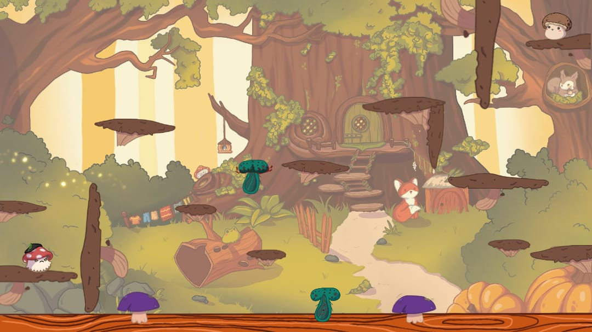

## 5.5. Diseño de ítems
Las paletas de colores de los objetos van en consonancia con las ya antes mencionadas y la estética general del videojuego.  

### 5.5.1. Hechizos
**Dazer**: Al utilizarse sobre el contrincante aplicará un efecto de congelamiento que durará 3s, durante ese tiempo el jugador sobre el que se ha aplicado no podrá realizar ninguna acción.

**Venom**: Al utilizarse sobre el contrincante aplicará efecto de veneno, este hará 1 de daño cada 3s y no dejará de aplicarse hasta que uno de los dos jugadores muera.

**Dalsy**: Al utilizarse restaura 10 puntos de vida al jugador que lo utilice.

**Teleport**: Al activarse, ambos jugadores se teletransportan al punto de partida. En caso de que uno de ellos tenga la bandera, ésta quedará en el suelo en el punto en el que se encontraba el jugador antes de utilizar el hechizo.

**Dash**: Al usarlo se efectuará un desplazamiento (lateral u horizontal) que atraviesa los obstáculos si los hubiera.

**Time machine**: Devuelve a las posiciones y los puntos de vida en las que se encontraban los jugadores e items 10s antes de emplearse.

**Monster**: Al emplearse el jugador que la utilice recibirá una mejora en velocidad, la mejora aumentará un 15% la velocidad base del jugador y durará 12s.

### 5.5.2. Banderas y casas
Las banderas son los ítems que deben capturar los jugadores. Cada estación tiene un diseño de bandera único. A continuación se muestran los cuatro diseños.
		

Las casas son las bases de las que parten los jugadores y a las que deben regresar con la bandera.

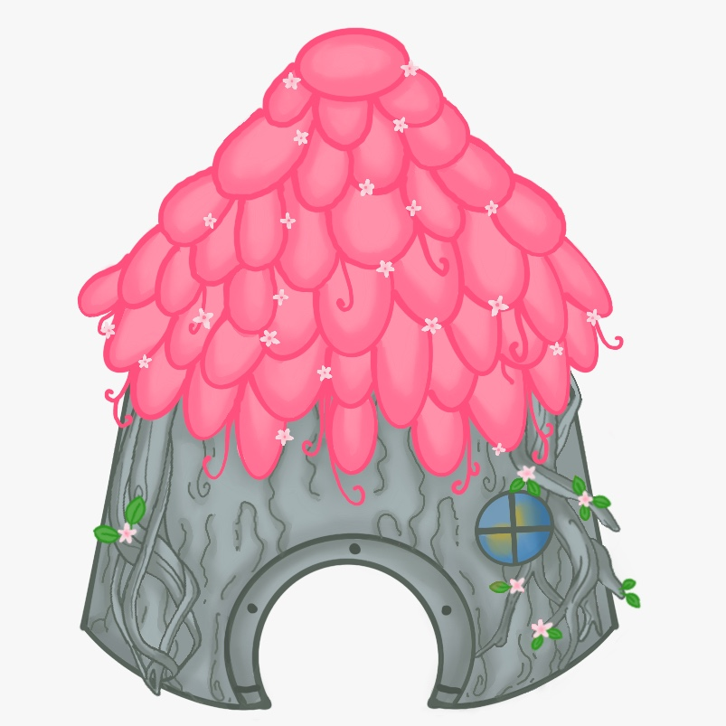

## 5.6. Interfaz de usuario
### 5.6.1 Pantalla de Inicio
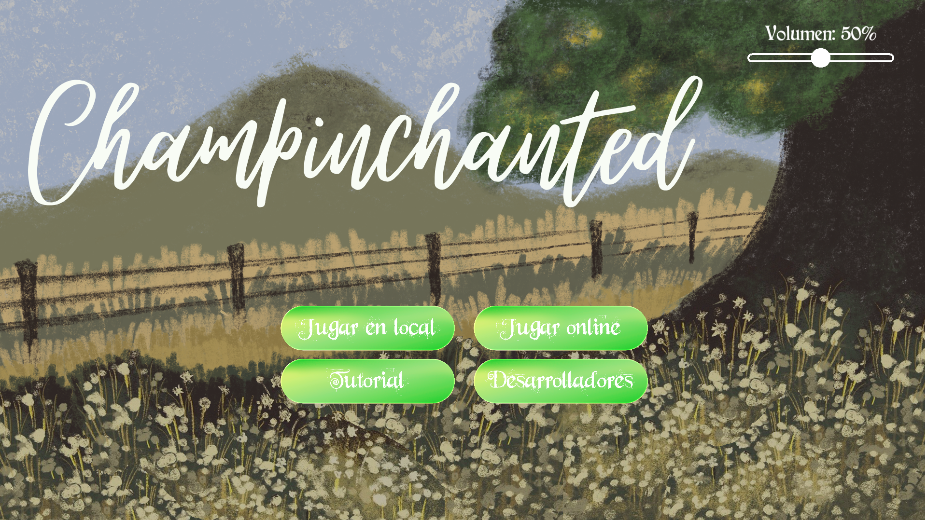
### 5.6.2 Pantalla de Tutorial

### 5.6.3 Pantalla de Creditos
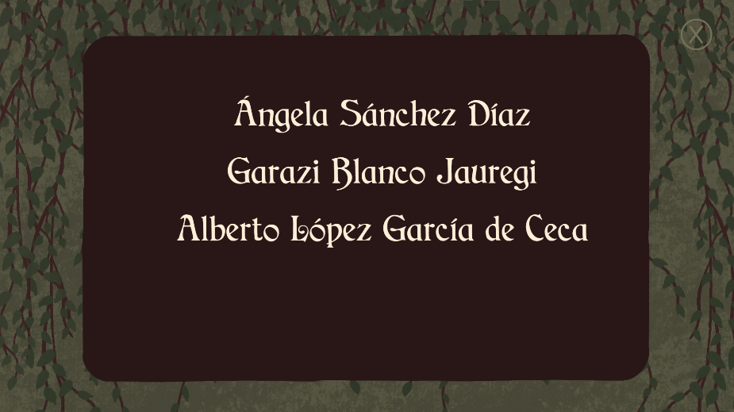
### 5.6.4 Pantalla de usuario
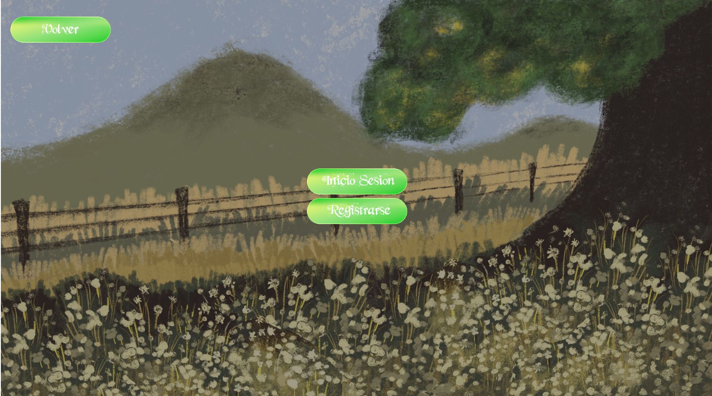
### 5.6.4.1 Pantalla de usuario - Inicio de sesión
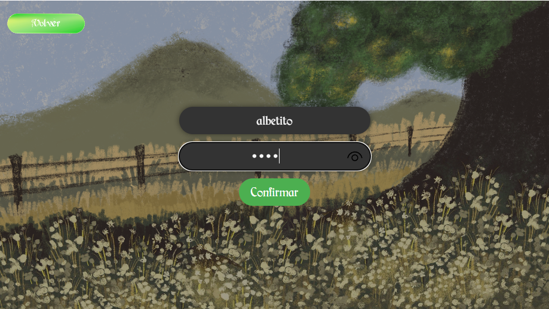
### 5.6.4.2 Pantalla de usuario - Registro
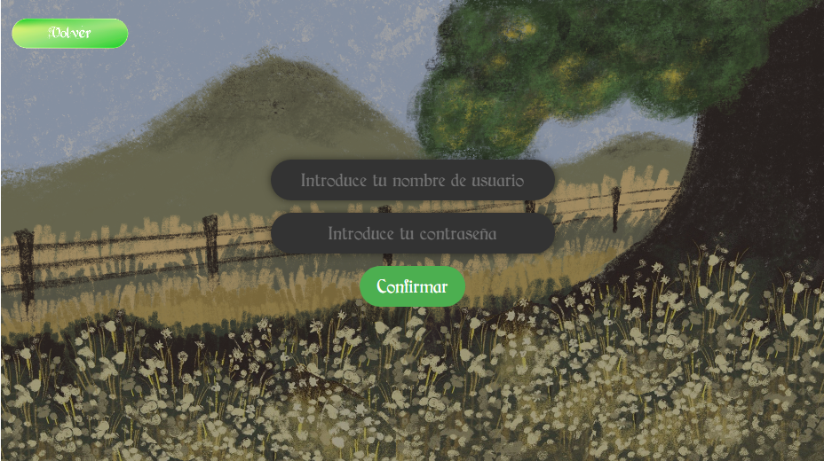
### 5.6.5 Pantalla de unirse a partida
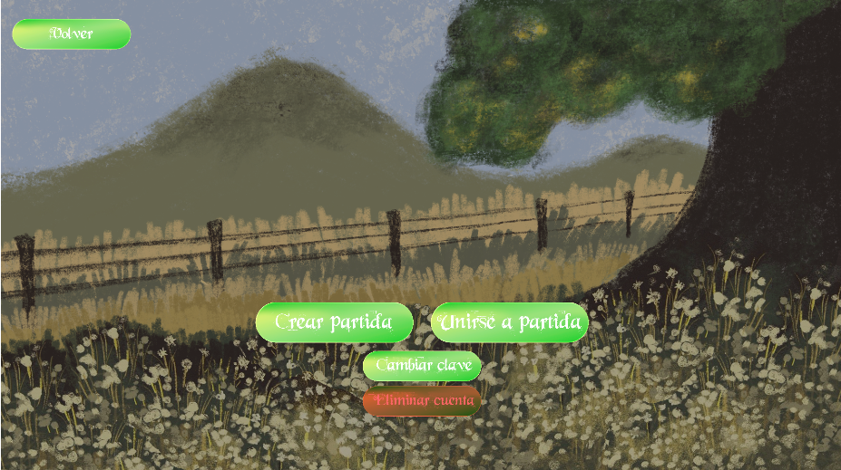
### 5.6.6 Pantalla de mapas
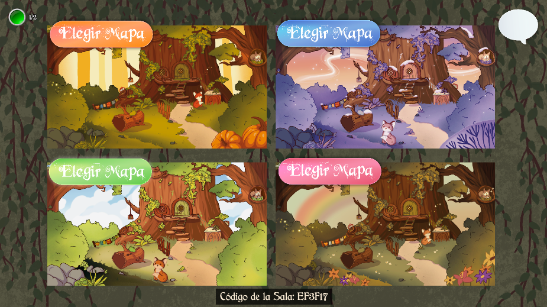
### 5.6.7 Pantalla de pausa
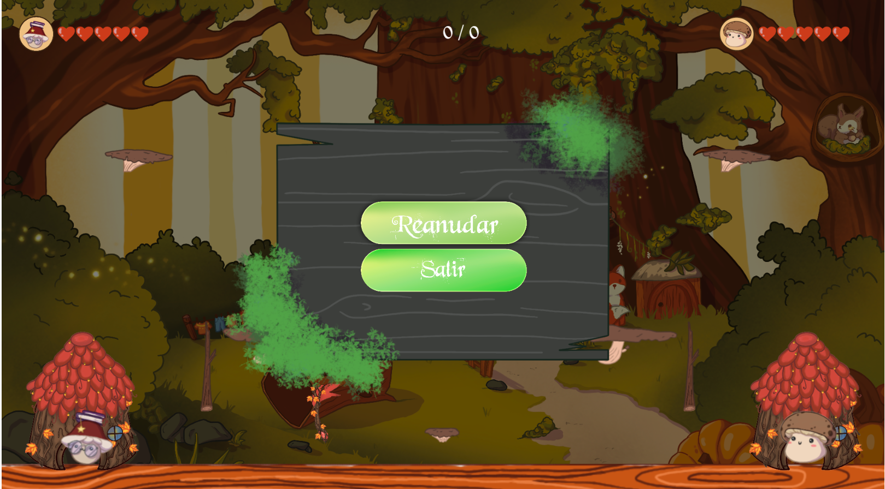
### 5.6.8 Pantallas de seleccion de personajes
5.6.8.1 Pantalla de seleccion de personajes (Local)

5.6.8.2 Pantalla de seleccion de personajes (En red)
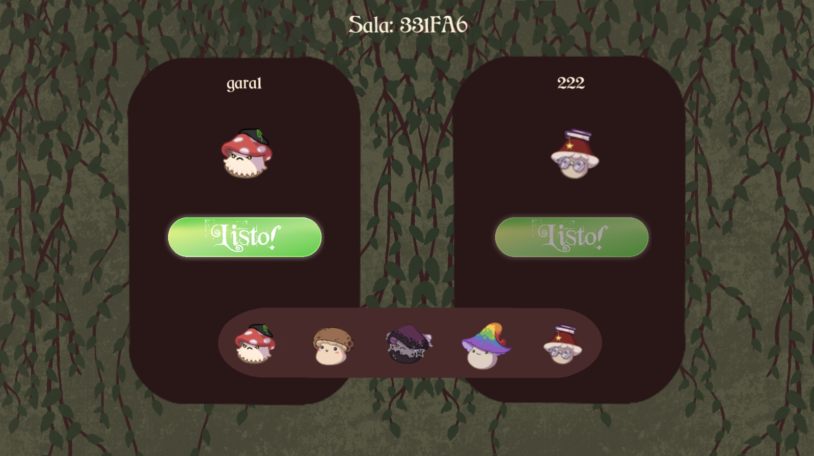
### 5.6.9 Pantalla de chat
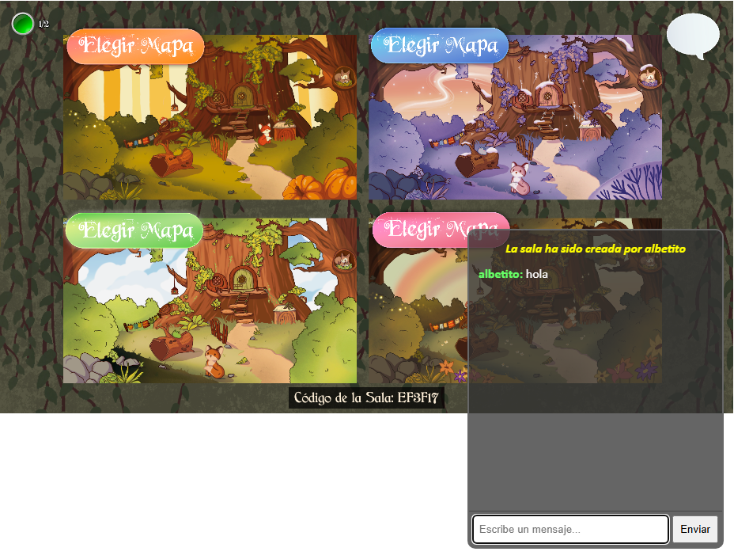
### 5.6.10 Pantalla de game
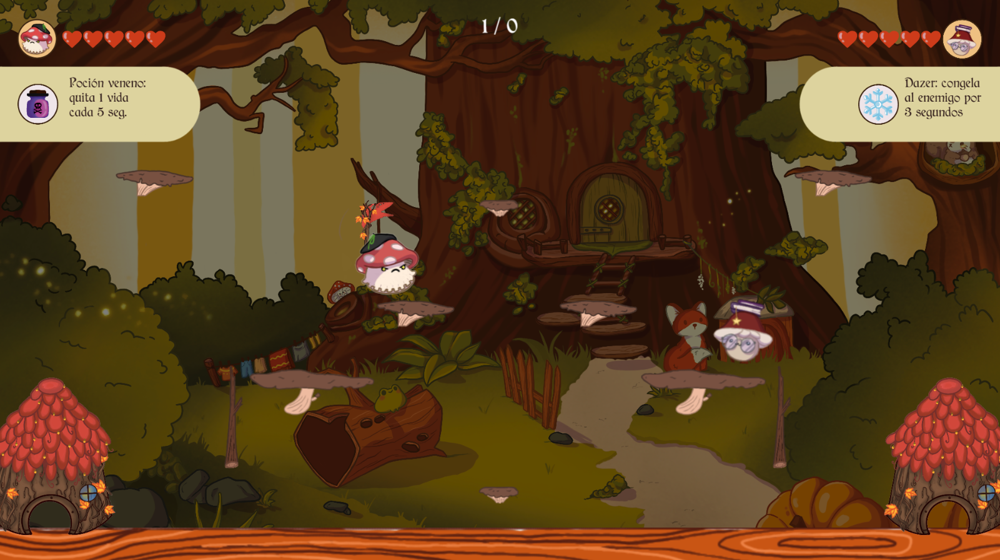

# 6. Arquitectura y guía de ejecución
## 6.1. Diagrama de clases
A continuación adjuntamos la explicación general de la estructura del proyecto y las relaciones entre las clases implemnentadas:
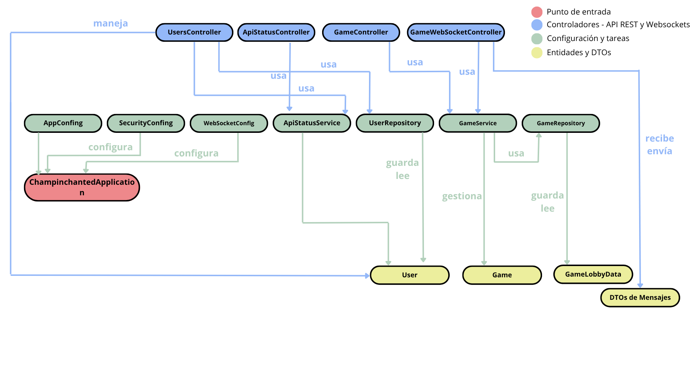

Además, hemos utilizado la plantilla UsernameUpdateRequest de tipo DTO (DataTransferObject), que se usa en el controlador para actualizar el nombre de usuario. 

## 6.2. Guía de ejecución
Para ejecutar el videojuego se debe ejecutar el archivo JAR (*champinchanted-0.0.1-SNAPSHOT*) desde la línea de comandos utilizando el comando: java -jar champinchanted-0.0.1-SNAPSHOT.jar.
Esto iniciará el servidor y la aplicación en el puerto configurado, que por defecto será el 8080.

Para poder ejecutar el videojuego y su backend, se debe tener instalado la versión 8 de Java o superior y Maven para compilar el proyecto.

Una vez que el servidor esté corriendo, se debe abrir el navegador web y cargar la url: http://{IP_del_servidor}:{Puerto}.
Esta URL abrirá la página principal del juegom donde se podrá interactuar con la aplicación. 

# 7. Implementación del Back-end
En esta fase del desarrollo, se ha implementado un back-end robusto utilizando Spring Boot para potenciar las funcionalidades online del juego y permitir la persistencia de datos.

## 7.1. Arquitectura del Back-end
El back-end sigue una arquitectura REST (Representational State Transfer), sirviendo como una API para que el cliente del juego (desarrollado en Phaser) pueda comunicarse de forma desacoplada y escalable. Toda la comunicación entre el cliente y el servidor, incluyendo el estado de las salas, notificaciones y chat, se realiza mediante peticiones HTTP.

La API REST gestiona los siguientes recursos:

Gestión de Cuentas de Usuario (/api/users): Proporciona endpoints para el registro, inicio de sesión, actualización de contraseña y borrado de usuarios. La seguridad de las contraseñas se garantiza mediante cifrado BCrypt.
Gestión de Partidas (/api/games): Permite a los usuarios crear y unirse a salas de juego. También ofrece endpoints para consultar el estado de una partida (como el número de jugadores) y para gestionar la "línea de tiempo" de eventos (chat y notificaciones del sistema).
Estado del Servidor y Actividad (/api/status, /api/ping): Incluye endpoints para verificar que el servidor está en línea y para monitorizar la actividad de los usuarios a través de un sistema de "heartbeats".
##7.2. Persistencia de Datos
El servidor asegura la persistencia de los datos críticos para que las sesiones de juego puedan sobrevivir a reinicios. La información de cuentas de usuario y el estado de las salas de juego (incluyendo el historial de eventos y chat) se almacena de forma permanente en ficheros .json en el disco duro del servidor. Una tarea programada se encarga de gestionar y limpiar las salas cuyos jugadores se han vuelto inactivos.

# 8. Fase 4: Inclusión de WebSockets
Esta sección detalla la arquitectura de red implementada para el modo de juego online, que actualiza la descrita en la sección anterior. La comunicación se basa en un modelo híbrido que utiliza una API REST para la gestión de usuarios y partidas (creación y unión), y WebSockets para toda la comunicación en tiempo real una vez dentro de una sala de juego.

## 8.1. Documentación del protocolo WebSocket
El protocolo de comunicación en tiempo real se implementa sobre STOMP (Simple Text Oriented Messaging Protocol) a través de WebSockets, lo que permite una comunicación estructurada basada en mensajes y "topics".

8.1.1. Conexión
El cliente establece una conexión WebSocket con el servidor en el endpoint /ws. Se utiliza SockJS como opción de fallback para garantizar una amplia compatibilidad con navegadores que no soporten WebSockets de forma nativa.

8.1.2. Mensajes del Servidor al Cliente (Topics)
Los clientes se suscriben a "topics" para recibir información del servidor. Todos los topics son específicos para cada partida, utilizando el {gameCode} en la ruta para asegurar que los mensajes lleguen solo a los jugadores de la sala correcta.

/topic/notifications/{gameCode}: Notifica sobre eventos en la sala, como la conexión o desconexión de un jugador.
Mensaje: NotificationMessage.

Contenido: content (String con el mensaje, p.ej., "JugadorX se ha unido") y playerCount (número actualizado de jugadores en la sala).
/topic/chat/{gameCode}: Retransmite los mensajes del chat a todos los jugadores en la sala.
Mensaje: ChatMessage.
Contenido: sender (remitente), content (mensaje) y gameCode.

/topic/games/{gameCode}: Envía el estado actualizado de la sala de espera (lobby) cuando un jugador elige personaje o marca su estado como "listo".

Mensaje: GameLobbyData.
Contenido: Datos completos de la sala (nombres de los jugadores, personajes seleccionados, estado de "listo" de cada uno, etc.).

/topic/games/{gameCode}/start: Indica al cliente que debe pasar de la pantalla de selección de mapa a la de selección de personaje. Se envía cuando el anfitrión selecciona un mapa.
Mensaje: StartGameMessage.

/topic/games/{gameCode}/gameplay_start: Inicia la partida. Se envía cuando ambos jugadores han marcado "listo" en la sala de espera.
Mensaje: StartGameMessage.
Contenido: Toda la información necesaria para inicializar el nivel: nombres de los jugadores, personajes elegidos y el mapa seleccionado.

/topic/gameplay/{gameCode}: Es el topic principal durante la partida. El servidor retransmite el estado completo y actualizado del juego a todos los clientes para mantenerlos sincronizados.
Mensaje: GameStateMessage.
Contenido: Incluye dos objetos PlayerState (uno por jugador), la posición y estado de la bandera, la visibilidad y posición de los hechizos, y el hechizo que posee cada jugador.

/topic/gameplay/{gameCode}/gameover: Anuncia el final de la partida cuando un jugador alcanza la puntuación para ganar.
Mensaje: GameOverMessage.
Contenido: winnerUsername (nombre del ganador) y las puntuaciones finales de ambos jugadores.

8.1.3. Mensajes del Cliente al Servidor (Destinos de Aplicación)
El cliente envía mensajes a destinos que comienzan con el prefijo /app. El servidor los procesa a través de los métodos del GameWebSocketController.

/app/chat.addUser: Un jugador notifica al servidor que se ha unido al chat de la sala.
Payload: ChatMessage.

/app/chat.sendMessage: Un jugador envía un mensaje de chat para ser retransmitido.
Payload: ChatMessage.

/app/game.selectMap: El anfitrión (primer jugador) notifica la selección del mapa de juego.
Payload: SelectMapMessage.

/app/game.selectCharacter: Un jugador notifica su selección de personaje.
Payload: SelectCharacterMessage.

/app/game.ready: Un jugador indica que está listo para empezar la partida.
Payload: Un Map<String, String> que contiene gameCode y username.

/app/game.updateState: Se envía de forma continua durante la partida para actualizar el estado de un jugador (principalmente su posición).
Payload: GameUpdateMessage.

/app/game.collectFlag, /app/game.collectSpell, /app/game.useSpell, /app/game.scorePoint: Mensajes para notificar al servidor sobre eventos de juego discretos e importantes.
Payload: Un Map<String, String> con los datos necesarios (gameCode, username, y spellType si aplica).

8.1.4. Manejo de Desconexiones
El servidor escucha el evento SessionDisconnectEvent para detectar cuando un cliente se desconecta. Al ocurrir, se actualiza el estado de la partida, se elimina al jugador y se notifica al participante restante a través del topic /topic/notifications/{gameCode}.

## 8.2. Actualización del Diagrama de Clases
Debido a limitaciones de la herramienta, no es posible generar una imagen actualizada del diagrama de clases. A continuación se describen las nuevas clases introducidas para la comunicación asíncrona y sus relaciones, que se suman a las ya existentes:

Configuración:
WebSocketConfig: Clase de configuración de Spring que habilita el message broker y registra el endpoint STOMP /ws para las conexiones WebSocket.

Controlador WebSocket:
GameWebSocketController: Es el centro neurálgico de la comunicación en tiempo real. Gestiona todos los mensajes WebSocket entrantes desde los clientes con métodos anotados con @MessageMapping. Utiliza SimpMessageSendingOperations para enviar mensajes a los topics y se apoya en GameService para ejecutar la lógica del juego.

Lógica de Negocio (Servicios):
GameService: Ha sido extendido significativamente para manejar toda la lógica del juego en tiempo real (movimiento, colisiones, uso de hechizos, control de vidas y puntuación). Se encarga de actualizar el estado de la partida y retransmitirlo a los clientes.

Objetos de Transferencia de Datos (DTOs): Son las clases que definen la estructura de los mensajes del protocolo.
GameStateMessage: Contiene el estado completo de la partida en un instante. Es el mensaje clave para la sincronización. Contiene dos objetos PlayerState.
PlayerState: Define todos los atributos de un jugador en un momento dado: posición (positionX, positionY), score, lives, y estados alterados como frozen o poisoned.
GameUpdateMessage: Mensaje más ligero enviado por el cliente para notificar su propio cambio de estado, principalmente su posición.
SelectCharacterMessage, SelectMapMessage, StartGameMessage, GameOverMessage, ChatMessage, NotificationMessage, ReadyStatusMessage: Son DTOs específicos para cada tipo de evento o notificación en el lobby y en el juego.

La relación principal en el flujo de juego es la siguiente: un Cliente envía un DTO al GameWebSocketController. Este invoca un método en GameService para procesar el cambio y actualizar el estado del objeto Game principal en memoria. Finalmente, el GameService construye un GameStateMessage completo y lo retransmite a todos los clientes suscritos al topic de la partida, asegurando la sincronización.
